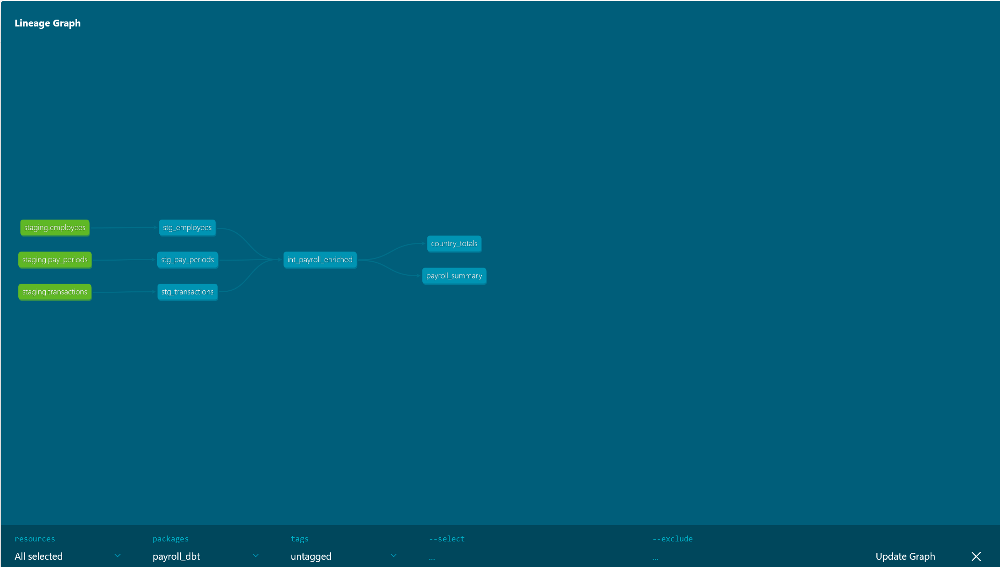

# Global Payroll ELT Pipeline

An end-to-end ELT pipeline for global payroll data processing, built with Apache Airflow, dbt, and PostgreSQL on a Dockerized infrastructure. Processes payroll transactions for 500 employees across 10 countries.

**Status:** ✅ Complete — All 4 Airflow tasks green | 13/13 dbt tests passing | Full lineage documented

---

## Pipeline Overview

```
Raw CSV Files (Faker-generated)
        │
        ▼
┌─────────────────────────────────────────┐
│           Apache Airflow DAG            │
│  Task 1: ingest_raw_data   ✅           │
│  Task 2: validate_files    ✅           │
│  Task 3: load_to_staging   ✅           │
│  Task 4: trigger_dbt_run   ✅           │
└─────────────────────────────────────────┘
        │
        ▼
┌─────────────────┐
│   PostgreSQL    │  ← staging schema
│  · employees    │     (500 rows)
│  · pay_periods  │     (12 rows)
│  · transactions │     (5,000 rows)
└─────────────────┘
        │
        ▼
┌─────────────────────────────────────────┐
│           dbt Transformation            │
│                                         │
│  Staging      stg_employees             │
│               stg_pay_periods           │
│               stg_transactions          │
│                    │                    │
│  Intermediate int_payroll_enriched      │
│                    │                    │
│  Marts        payroll_summary           │
│               country_totals            │
└─────────────────────────────────────────┘
        │
        ▼
  Analytics-ready tables for BI reporting
```

---

## Screenshots

### Airflow DAG — all 4 tasks green


### dbt Lineage Graph — full data lineage from source to mart


---

## Tech Stack

| Layer | Tool | Version |
|---|---|---|
| Orchestration | Apache Airflow | 2.8.1 |
| Transformation | dbt Core | Latest |
| Database | PostgreSQL | 15 |
| Infrastructure | Docker Compose | - |
| Language | Python | 3.11 |
| Data Generation | Faker | Latest |
| Version Control | Git / GitHub | - |

---

## Project Structure

```
payroll-elt-pipeline/
├── dags/
│   └── payroll_elt_dag.py        ← Airflow DAG (4 tasks)
├── ingestion/
│   ├── generate_data.py          ← Synthetic data generator (Faker)
│   └── load_to_postgres.py       ← CSV → PostgreSQL loader
├── dbt/
│   └── payroll_dbt/
│       ├── dbt_project.yml
│       └── models/
│           ├── staging/
│           │   ├── sources.yml
│           │   ├── stg_employees.sql
│           │   ├── stg_pay_periods.sql
│           │   └── stg_transactions.sql
│           ├── intermediate/
│           │   └── int_payroll_enriched.sql
│           └── marts/
│               ├── payroll_summary.sql
│               └── country_totals.sql
├── docs/
│   ├── airflow_dag.png           ← Airflow all-green screenshot
│   └── lineage_graph.png         ← dbt lineage graph
├── data/                         ← Generated CSVs (gitignored)
├── plugins/                      ← Airflow plugins
├── docker-compose.yml
└── .gitignore
```

---

## How to Run

### Prerequisites

- Docker Desktop installed and running
- Python 3.11+
- Git

### 1. Clone the repository

```bash
git clone https://github.com/Temitope96/payroll-elt-pipeline.git
cd payroll-elt-pipeline
```

### 2. Start Docker containers

```bash
# Initialize Airflow database first
docker-compose up airflow-init

# Start all services
docker-compose up -d airflow-webserver airflow-scheduler postgres
```

Wait ~30 seconds, then go to `http://localhost:8080`
Login: `admin` / `admin`

### 3. Install Python dependencies in containers

```bash
docker exec payroll-elt-pipeline-airflow-scheduler-1 pip install faker pandas sqlalchemy psycopg2-binary dbt-postgres
docker exec payroll-elt-pipeline-airflow-webserver-1 pip install faker pandas sqlalchemy psycopg2-binary dbt-postgres
```

### 4. Create dbt profiles inside the container

```bash
docker exec -it payroll-elt-pipeline-airflow-scheduler-1 bash -c "
mkdir -p /home/airflow/.dbt && cat > /home/airflow/.dbt/profiles.yml << 'EOF'
payroll_dbt:
  target: dev
  outputs:
    dev:
      type: postgres
      host: postgres
      user: airflow
      password: airflow
      port: 5432
      dbname: airflow
      schema: dbt_dev
      threads: 4
EOF
"
```

### 5. Set up local Python environment

```bash
python -m venv venv
source venv/Scripts/activate      # Windows Git Bash
pip install faker pandas psycopg2-binary sqlalchemy dbt-postgres
```

### 6. Trigger the Airflow DAG

- Go to `http://localhost:8080`
- Find `payroll_elt_pipeline`
- Click the ▶ play button → **Trigger DAG**
- Watch all 4 tasks turn green in the Graph view

### 7. Run dbt manually (optional)

```bash
cd dbt/payroll_dbt
dbt debug        # test connection
dbt run          # run all 6 models
dbt test         # run 13 data quality tests
dbt docs generate && dbt docs serve   # browse lineage graph
```

### 8. Stop the environment

```bash
docker-compose down        # stops containers, preserves data
docker-compose down -v     # stops containers AND deletes all data
```

---

## DAG Overview

The `payroll_elt_pipeline` DAG runs on a `@daily` schedule:

```
ingest_raw_data → validate_files → load_to_staging → trigger_dbt_run
```

| Task | Type | Description |
|---|---|---|
| `ingest_raw_data` | PythonOperator | Generates 500 employees, 12 pay periods, 5,000 transactions via Faker |
| `validate_files` | PythonOperator | Checks all 3 CSV files exist and are non-empty |
| `load_to_staging` | PythonOperator | Loads CSVs into PostgreSQL staging schema with `_loaded_at` metadata |
| `trigger_dbt_run` | BashOperator | Runs `dbt run && dbt test` — transforms and validates all models |

**Retry logic:** 1 retry with 1-minute delay on all tasks.
**Catchup:** disabled — no historical backfill runs.

---

## dbt Models

### Staging layer (materialized as views)
Cleans and casts raw data. No business logic.

| Model | Source | Key transformations |
|---|---|---|
| `stg_employees` | staging.employees | Adds `full_name`, lowercases email, uppercases country_code |
| `stg_pay_periods` | staging.pay_periods | Casts date columns, filters null period_ids |
| `stg_transactions` | staging.transactions | Uppercases status and currency_code, casts numeric columns |

### Intermediate layer (materialized as table)
Joins and enriches — all business logic lives here.

| Model | Description |
|---|---|
| `int_payroll_enriched` | Joins transactions + employees + pay_periods. Adds `is_successful` flag based on status. |

### Mart layer (materialized as tables)
Analytics-ready aggregations for BI consumption.

| Model | Description |
|---|---|
| `payroll_summary` | Headcount, gross/net pay totals grouped by country, department, and pay period |
| `country_totals` | Total employees, transactions, and payment volumes grouped by country and year |

---

## Data Quality

**13 dbt tests — all passing ✅**

| Test | Column | Model |
|---|---|---|
| unique | employee_id | stg_employees |
| not_null | employee_id | stg_employees |
| unique | email | stg_employees |
| not_null | email | stg_employees |
| not_null | country_code | stg_employees |
| accepted_values | country_code (10 values) | stg_employees |
| not_null | salary_usd | stg_employees |
| unique | transaction_id | stg_transactions |
| not_null | transaction_id | stg_transactions |
| not_null | employee_id | stg_transactions |
| relationships | employee_id → stg_employees | stg_transactions |
| accepted_values | status (PROCESSED/PENDING/FAILED) | stg_transactions |
| not_null | net_pay_usd | stg_transactions |

---

## Design Decisions

**ELT over ETL** — raw data is loaded into PostgreSQL first before any transformation. This preserves the original data for auditability, debugging, and reprocessing without re-extraction.

**`_loaded_at` metadata column** — added to all staging tables at load time via Python rather than a database default. Records exactly when each batch was ingested, enabling incremental load strategies and pipeline debugging.

**CASCADE drop on reload** — `load_to_postgres.py` drops staging tables with `CASCADE` before reloading. This cleanly removes dependent dbt views without manual intervention, making reruns idempotent.

**Environment-aware DB connection** — `load_to_postgres.py` reads `DB_HOST` from environment variables. Defaults to `localhost` for local runs, uses `postgres` (Docker service name) when called from Airflow inside Docker. Same script, two environments, zero code changes.

**`sys.executable` in DAG** — uses the same Python interpreter Airflow is running rather than a hardcoded path, making the DAG portable across container environments.

**Retry logic on all tasks** — 1 retry with 1-minute delay protects against transient failures such as container startup timing or momentary network issues between services.

**`catchup=False`** — prevents Airflow from backfilling historical runs when the DAG is first enabled or unpaused after a period of inactivity.

**3-layer dbt architecture** — staging → intermediate → mart separates concerns cleanly. Staging owns raw-to-clean casting, intermediate owns joins and business logic, marts own aggregations. Each layer is independently testable and replaceable.

---

## Environment Variables

| Variable | Default | Description |
|---|---|---|
| `DB_HOST` | `localhost` | PostgreSQL host (`postgres` inside Docker) |
| `DATA_OUTPUT_DIR` | `../data` | Output directory for generated CSV files |

---

## Troubleshooting

**Docker not starting**
Open Docker Desktop and wait for the whale icon in your taskbar to stop animating.

**`faker` / `dbt` module not found in Airflow**
```bash
docker exec payroll-elt-pipeline-airflow-scheduler-1 pip install faker pandas sqlalchemy psycopg2-binary dbt-postgres
```

**`could not translate host name "postgres"`**
You're running the script locally. Set `DB_HOST=localhost` or the script defaults to it automatically.

**Permission denied on `/opt/airflow/data`**
```bash
docker exec -u root payroll-elt-pipeline-airflow-scheduler-1 chmod 777 //opt/airflow/data
```

**dbt `_loaded_at` column does not exist**
Re-run `load_to_postgres.py` — the column is added at load time, not at table creation.

**dbt views block staging table reload**
The loader now uses `DROP TABLE ... CASCADE` automatically. If running manually:
```bash
docker exec -it payroll-elt-pipeline-postgres-1 psql -U airflow -d airflow -c "DROP SCHEMA dbt_dev CASCADE; CREATE SCHEMA dbt_dev;"
```

**Packages reset after `docker-compose down`**
Re-run the `pip install` commands in Step 3 and recreate the dbt profiles file in Step 4.

---

## Resume Checklist

Starting a new session after shutdown:

```bash
# 1. Open Docker Desktop — wait for whale icon to go steady
# 2. Start containers
docker-compose up -d

# 3. Wait 30 seconds, confirm Airflow is up at http://localhost:8080

# 4. Reinstall packages (if docker-compose down -v was used)
docker exec payroll-elt-pipeline-airflow-scheduler-1 pip install faker pandas sqlalchemy psycopg2-binary dbt-postgres

# 5. Recreate dbt profiles (if containers were fully removed)
# Run the profiles.yml creation command from Step 4 above

# 6. Activate local virtual environment
source venv/Scripts/activate

# 7. Trigger a manual DAG run to confirm everything still works
```

---

## What This Project Demonstrates

| Skill | Implementation |
|---|---|
| ETL/ELT pipeline design | 4-task Airflow DAG with sequential dependencies |
| Workflow orchestration | Apache Airflow with retry logic, scheduling, and manual triggering |
| Data transformation | dbt 3-layer architecture (staging → intermediate → mart) |
| Data modeling | Star-schema-style mart tables with dimensional aggregations |
| Data quality | 13 dbt tests covering uniqueness, nulls, relationships, accepted values |
| Cloud-native thinking | Docker Compose, environment-aware configuration, service networking |
| Python engineering | Faker data generation, SQLAlchemy loading, subprocess orchestration |
| Documentation | Data lineage graph, architecture diagram, comprehensive README |
| Version control | Git with meaningful commit history, .gitignore best practices |

---

## Author

**Temitope Mafimidiwo** — Data Engineer
[LinkedIn](https://linkedin.com/in/yourprofile) · [GitHub](https://github.com/Temitope96)
